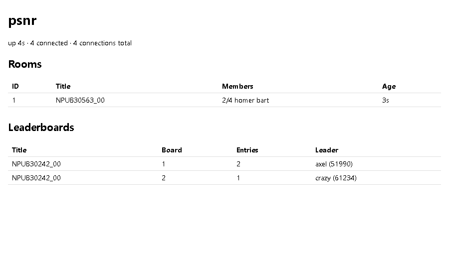

# psnr

A stand-in for PSN's matchmaking rooms and leaderboards, for PS3 titles
statically recompiled with [ps3recomp](https://github.com/sp00nznet/ps3recomp).
It is the PS3 counterpart of [xlive](https://github.com/sp00nznet/xlive). The
server hands out rooms and each peer's address; the players' game traffic then
goes directly between them.

## Status

**v0.1.0, alpha.**
- **Server:** rooms (Matching2-style) and leaderboards (Score-style) work, and
  the C client works. Both are tested against each other on Windows and Linux.
- **Games:** Simpsons Arcade matchmakes through psnr, with two instances on one
  machine: create match, Quick Match, join, and each side learns the other's
  P2P address. The game's own session doesn't start yet. That work is in
  [ps3recomp#200](https://github.com/sp00nznet/ps3recomp/pull/200) (draft),
  which builds on the merged
  [ps3recomp#196](https://github.com/sp00nznet/ps3recomp/pull/196).
  [ROADMAP.md](ROADMAP.md) has the rest.

## Screenshots

The status page (`http://127.0.0.1:36101/`) with one room open and two
leaderboards:



## Getting Started

### Quick start

1. Download this repository as a zip and unpack it.
2. Double-click **`Setup.cmd`** (Windows) or run **`./setup.sh`** (Linux/macOS).
   - The script checks for Go and asks before installing it (winget, about
     70 MB).
   - It then builds the server and leaves a **`Start psnr.cmd`** (or
     `start-psnr.sh`) launcher in the folder.
3. Run the launcher, then open http://127.0.0.1:36101/ in a browser.

If setup fails, it prints one line saying what to do and where the full log is.

### Step by step

Prerequisites: Go 1.22 or newer (`go version`). On Windows, a new terminal
window is needed after installing Go before `go` is on `PATH`.

1. Build:
   ```
   cd server
   go build -o psnr.exe .     # "psnr" on Linux/macOS
   ```
2. Run:
   ```
   psnr.exe
   ```
   Expected output:
   ```
   2026/09/29 02:17:35 psnr 0.1.0: clients on [::]:36100
   2026/09/29 02:17:35 status page on http://127.0.0.1:36101/
   ```
3. Open http://127.0.0.1:36101/. It shows no rooms and no leaderboards until a
   client connects.

Players connect to TCP 36100. Ports, flags and Docker are covered in
[docs/running.md](docs/running.md).

## Usage

```
psnr -addr :36100 -http 127.0.0.1:36101 -v    # log every room event
docker compose up -d                          # same thing, in a container
curl http://127.0.0.1:36101/api/stats         # rooms and boards as JSON
```

To talk to it from C, add `client/psnr.c` and `client/psnr.h` to the build:

```c
psnr_client* c = psnr_connect("server", 36100, "NPWR00860_00", "alice",
                              3658 /* P2P port */, &user_id, public_ip);
uint32_t req = psnr_send(c, PSNR_SEARCH_ROOMS, body, len);   /* async */
psnr_msg m;
while (psnr_poll(c, &m) == 1) {        /* replies and pushes, never blocks */
    /* m.req == req for its reply; m.req == 0 for MEMBER_JOINED etc. */
    psnr_msg_free(&m);
}
```

Every message is documented in [docs/api.md](docs/api.md).

## Docs

- [docs/architecture.md](docs/architecture.md): the parts, why the client has
  no threads, and why game traffic doesn't go through the server
- [docs/api.md](docs/api.md): the protocol
- [docs/running.md](docs/running.md): flags, ports, Docker, state

## Building from source

```
go vet ./...
go test ./...      # also builds and runs client/test_psnr.c if a C compiler is on PATH
```

To test the C client on its own against a running server:

```
cc -std=gnu11 -o test_psnr client/psnr.c client/test_psnr.c    # add -lws2_32 on Windows
./test_psnr 127.0.0.1 36100
```

## License

MIT. See [LICENSE](LICENSE).
